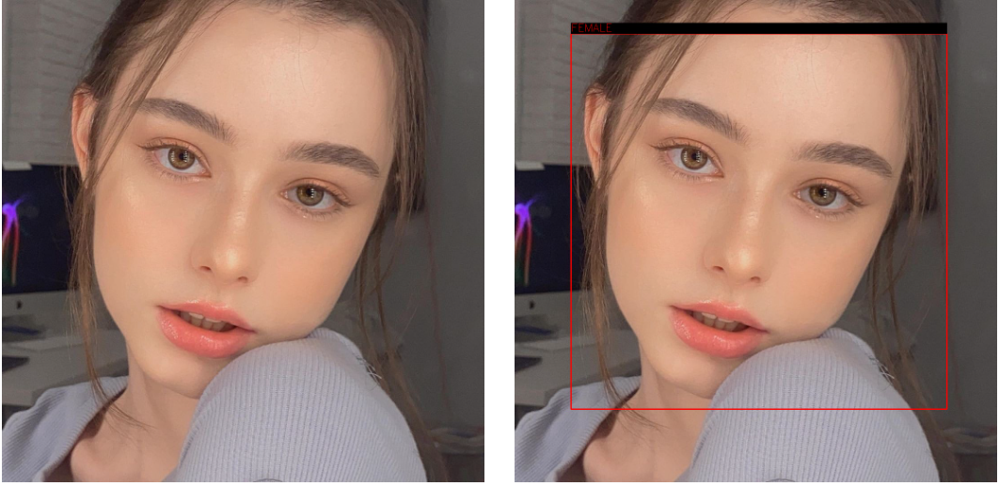

# Gender-Classification-Detecion
Build Machine learning model that can classify the gender in a given image
See the demo [here](https://otman-ai-gender-classification--hello-sko6hj.streamlit.app/)
## Content of this page:
* [What is gender classification](#what-is-gender-classification)
* [How to use this repo](#how-to-use-this-repo)

##  What is gender classification:
Gender classification system uses face of a person from a given image to tell the gender (male/female) of the given person. A successful gender classification approach can boost the performance of many other applications including face recognition and smart human-computer interface.basically gender classification is one of computer vision problem.


## How to use this repo:
To use this repo first, you need to clone it with this cammand below:
```
git clone https://github.com/otman-ai/Gender-Classification.git
```
After that you have to create your virtuel enviroment.Go to the your local directory then type:

```
python -m venv genderclassification
```
install all the requirements:
```
pip install requirements.txt
```
in the repo you can find :
* `Gender Classification Prototype` whitch is notebook that content all of model building codes. 
* `👋_Hello.py` python script that deploys the model in to web server with  a help of streamlit.
* `model_performances.csv` file i csv formatn that track our models performance 
* inside *pages* folder there is :
* * `1_📈_Model_Insights.py`:model insight page 
* * `2_🌍_Model_Building_Processe.py`: model building processe page
* * `3_📊_About_us.py` : about the creator of the project page

To see the demo run the following command:

```
streamlit run 👋_Hello.py
```
